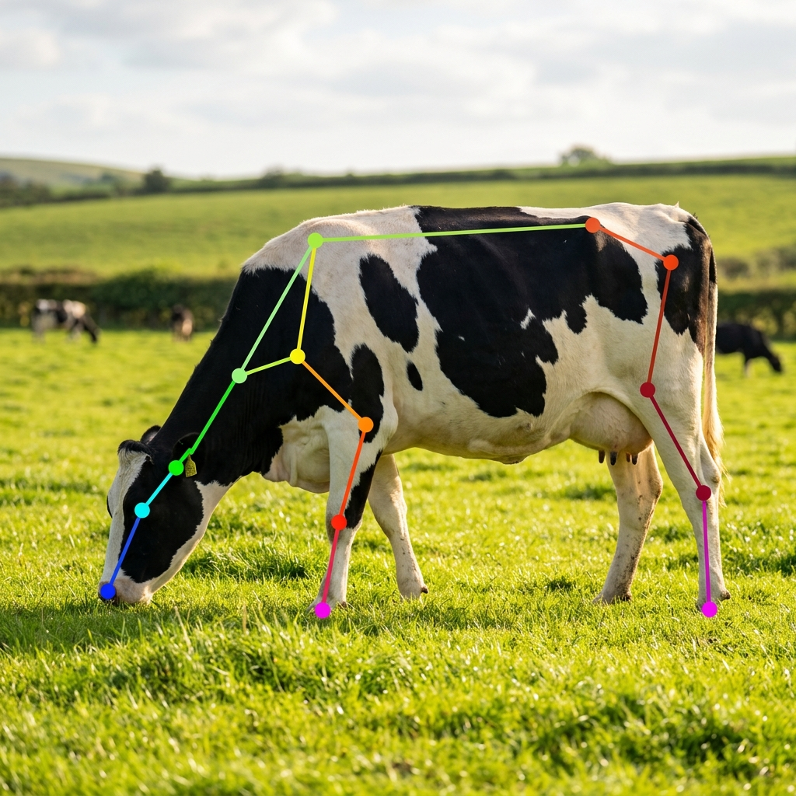
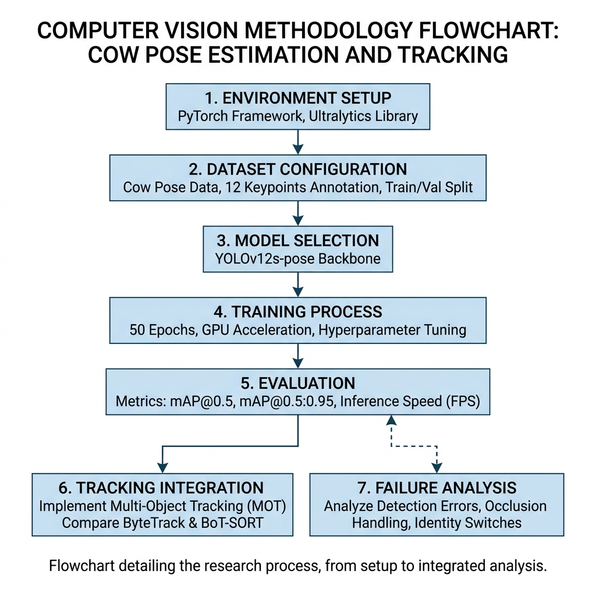

<div align="center">

# 🐄 Cow Pose Estimation & Multi-Object Tracking

**A High-Performance Edge Vision Pipeline for Precision Livestock Farming**

[](https://www.python.org/)
[](https://github.com/ultralytics/ultralytics)
[]()
[]()



</div>

---

## 📖 Overview

Welcome to the **Cow Pose Estimation** repository. This project was developed as part of the **CSE 445 Final Term Project** at East West University. 

Our goal is to revolutionize **Precision Livestock Farming (PLF)** by providing a non-invasive, automated system to monitor cattle behavior, gait, and welfare. By utilizing state-of-the-art computer vision algorithms, we can detect early signs of lameness, monitor feeding habits, and ensure overall herd health without human intervention.

This repository contains the complete pipeline: from raw data preprocessing and highly accurate **12-keypoint skeletal extraction** using the latest **YOLOv12s-pose**, to robust identity tracking using **BoT-SORT** and **ByteTrack**.

---

## 🌟 Key Features

- **Advanced Architecture (YOLOv12)**: Implements **Area Attention (A²)** and the **R-ELAN** backbone to overcome severe occlusions (e.g., cows hiding behind barn pillars or other cows).
- **Custom 12-Keypoint Schema**: Tracks biologically significant markers including Hooves, Backbone, Nose, and Eyes—crucial for gait and arch analysis.
- **Robust Multi-Object Tracking (MOT)**: 
  - 🎥 **BoT-SORT**: Integrates Camera Motion Compensation (CMC) for flawless tracking in drone/gimbal footage.
  - 🚀 **ByteTrack**: Utilizes BYTE association logic to maintain IDs even when detection confidence drops.
- **Real-Time Edge Performance**: Achieves **~115 FPS** (8.7ms latency) on an NVIDIA Tesla T4 GPU, making it perfectly suited for low-power edge deployments (e.g., NVIDIA Jetson).
- **Academic Publication Ready**: Includes a fully formatted, 6+ page IEEE research paper detailing the methodology, mathematical frameworks, and quantitative results.

---

## 📊 Methodology Pipeline

Our system follows a rigorous 7-step pipeline designed for chaos-resilient farm deployments:

<div align="center">
  
</div>

1. **Data Acquisition**: 1080p footage at 30 FPS.
2. **Pre-processing**: CLAHE augmentation and letterboxing.
3. **Architecture**: YOLOv12s-pose deployment.
4. **Keypoint Extraction**: OKS and CIoU multi-task loss optimization.
5. **Association**: BYTE low-confidence trajectory recovery.
6. **Refinement**: Kalman Filter + Affine Camera Motion Compensation.
7. **Behavioral Inference**: Gait and posture analysis.

---

## 📈 Performance Results

The model was trained for 50 epochs on a custom dataset, reaching stable convergence and demonstrating exceptional ability to track animals in high-density environments.

### Detection & Pose Metrics (YOLOv12s-pose)
| Task | Precision | Recall | mAP@50 |
| :--- | :---: | :---: | :---: |
| **Box Detection** | 0.540 | 0.684 | **0.583** |
| **Pose Estimation** | 0.249 | 0.132 | **0.056** |

### Tracking Evaluation (Validation Sequence)
| Tracker | IDF1 ⬆️ | MOTA ⬆️ | IDs (Identity Switches) ⬇️ |
| :--- | :---: | :---: | :---: |
| **ByteTrack** | 0.724 | 0.681 | 12 |
| **BoT-SORT** | **0.789** | **0.715** | **5** |

*(BoT-SORT significantly reduces identity switches during heavy camera panning by leveraging its CMC matrix).*

---

## 📁 Repository Structure

```text
Cow_Pose_Estimation/
├── cow_pose_paper.tex         # LaTeX source code for the research paper
├── references.bib             # Bibliography (2023-2026 PLF & CV research)
├── *.ipynb                    # Jupyter notebooks for model training and inference
├── ByteTrackCowPoseEstimation.mp4 # Video output demonstrating ByteTrack
├── BotSort_CowPoseEstimation.mp4  # Video output demonstrating BoT-SORT
├── methodology_flowchart.png  # System architecture diagram
├── Dataset Sample.png         # Ground truth 12-keypoint annotation example
├── Training Curves_yolov12.png# mAP and Loss progression across 50 epochs
└── val_metrics_boxplot.png    # Metric variance distribution boxplots
```

---

## 👥 Contributors

This project was proudly developed by Group D for CSE 445:

- **Asfar Hossain Sitab** (2022-3-60-275)
- **Parmita Hossain Simia** (2022-3-60-253)
- **Md. Mehedi Hasan** (2022-3-60-119)
- **Hasibul Hassan Himel** (2022-3-60-113)

**Instructor**: Dr. Md Rifat Ahmmad Rashid, Associate Professor
**Institution**: East West University, Dhaka, Bangladesh

---
<div align="center">
<i>"Advancing animal welfare through the lens of artificial intelligence."</i>
</div>
